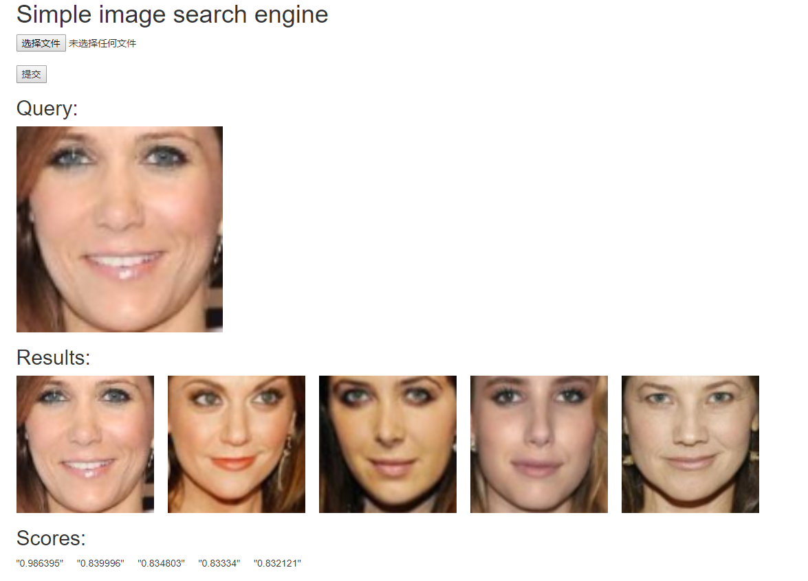

# face-retrieval-based-on-cnn-and-flask

## 代码运行环境

1.keras：Theano for backend ；keras 2.0.1 及 2.0.5 版本均经过测试可用。

2.python：推荐Python 2.7，支持Python 3.6.

此外需要numpy, matplotlib, os, h5py, argparse. 推荐使用anaconda安装

### 如何运行代码

- step1:首先将你的人脸库提取特征到h5文件保存

`python generate_index.py -database <path-to-your-database-to-be-extracted-features> -index <name-for-your-output-index>`

- step2：起flask服务，进行检索

`python server_query.py`

```sh
├── database 人脸图像数据集
├── extract_cnn_vgg16_keras.py 使用预训练vgg16模型提取图像特征
|── generate_index.py 对图像集提取特征，建立索引
├── server_query.py 库内搜索
└── README.md
```

#### 示例

```sh
# 对database文件夹内图片进行特征提取，建立索引文件xxx.h5
python generate_index.py -database database -index facefeatureCNN.h5

# 代码中显示返回的top5张近似图片
```

### 结果显示




### 注意事项

- 提取特征之前一定要对人脸图像进行人脸框提取和对齐；
- 需要将你的人脸库所有image放到static/img;
- static/upload文件夹：用来存放你上传提交的query image；
- 显示检索得到的图片， 可自由定义查询图片及检索图片集，也可以自定义返回的top n结果。
